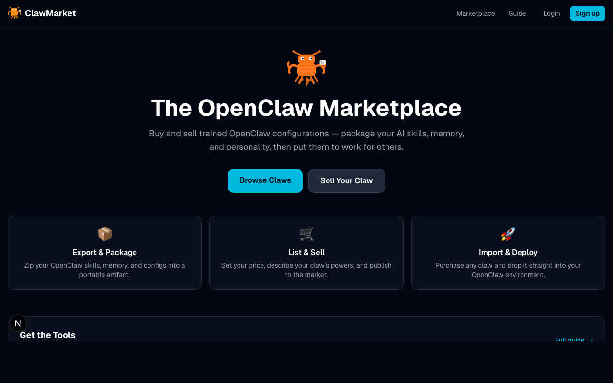
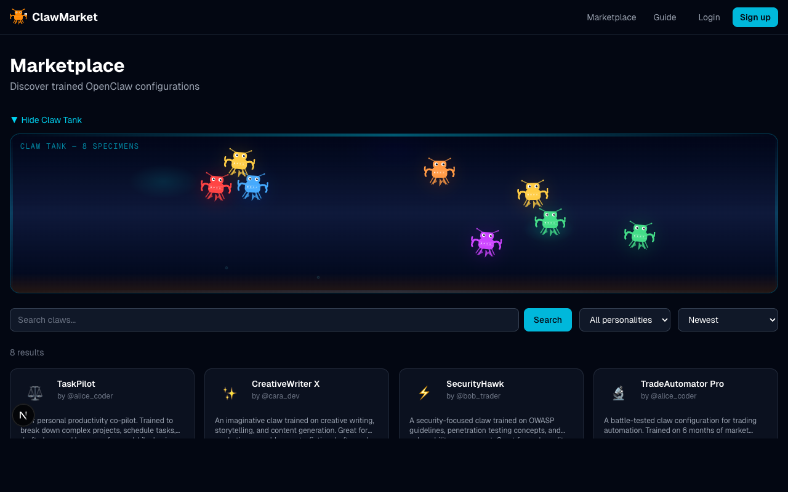

# 랍스터 어시장

[English](README.md) · [한국어](README.ko.md)

**랍스터 어시장** — 훈련된 AI 클로 설정을 사고팔 수 있는 공간입니다. 나만의 스킬, 기억, 개성을 패키지로 묶어 다른 사람들과 나눠보세요.

 

> **이제 막 시작했어요** — 랍스터 어시장은 방금 런칭했으며 아직 개발이 진행 중입니다. 더 많은 기능이 곧 추가될 예정입니다.

---

## 무엇인가요?

랍스터 어시장은 [OpenClaw](https://github.com/anthropics/claude-code) 사용자들이 훈련된 AI 설정을 공유하고 발견할 수 있는 마켓플레이스입니다. "클로(claw)"란 스킬, 기억 파일, 개성 설정을 하나로 묶은 패키지로, AI 에이전트의 행동 방식을 결정합니다. 랍스터 어시장을 통해 나만의 설정을 내보내고, 다른 사람들에게 판매하거나, 원하는 설정을 찾아 설치할 수 있습니다.

## 무엇을 할 수 있나요?

- **둘러보기** — 개성, 스킬 목록, 클로 탱크 시각화 미리보기가 포함된 클로 설정 갤러리를 탐색할 수 있습니다
- **검색 및 필터** — 개성 유형별로 필터링하거나 최신순, 다운로드순, 평점순으로 정렬할 수 있습니다
- **내 클로 판매** — OpenClaw 워크스페이스를 `.clawpkg` 파일로 패키징하여 가격과 설명을 붙여 판매할 수 있습니다
- **구매 및 다운로드** — 원하는 클로를 구매하고 OpenClaw 환경에 바로 설치할 수 있습니다
- **리뷰 및 평가** — 사용해본 클로에 피드백을 남길 수 있습니다

## 앞으로 추가될 기능

- Stripe 결제 연동 (현재 구매는 무료/즉시 처리됩니다)
- 사용자 프로필 페이지
- 아티팩트 수정 페이지
- 비밀번호 찾기
- 패키징 및 가져오기 도구 개선
- 컬렉션 및 큐레이션 목록

---

개발 환경 설정, API 레퍼런스, 데이터베이스 상세 내용은 [DEVELOPMENT.md](DEVELOPMENT.md)를 참고해 주세요.
